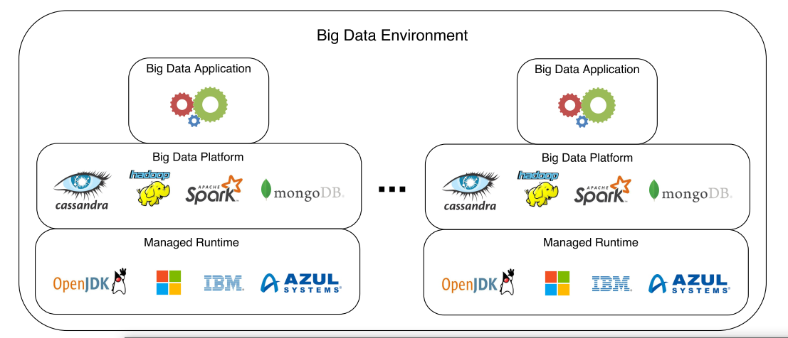
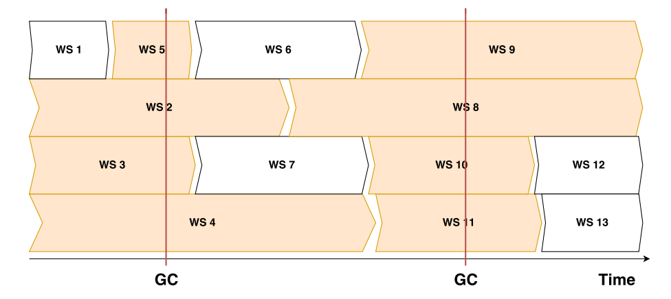
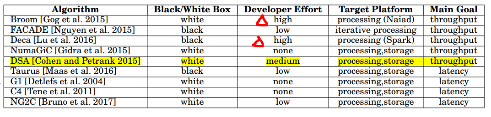

## A Study on Garbage Collection Algorithms for Big Data Environments    

​	这篇 survey 讲得是面向大数据环境的 GC 算法，主要包括大数据环境（BDE）的介绍、GC的介绍、在大数据环境下使用GC碰到的问题以及针对上述问题提出的面向 BDE 的 GC 算法。总结的最后一部分是启发与感想。

### 1. 背景介绍

​	大数据场景下涌现许多具有各种功能的大数据系统，其目的在于挖掘海量数据蕴含的信息。考虑到托管型语言的优势，尤其是 Java（迅速的开发周期以及丰富的社区资源），因此托管型语言被广泛应用于大数据系统。但托管型语言也会带来额外的性能开销，尤其是面向大数据应用时，这些开销会显著增加，而造成开销增加的原因正是自动内存管理方案。因此，许多致力于优化自动内存管理方案（GC）的研究工作相继出现。本文阐述了大数据系统的内存模式，此外，本文还介绍了 GC 的基础知识并总结了众多面向大数据系统的 GC 算法。

#### 1.1 BDE

​	BDE，即 Big Data Environment，主要介绍了两部分内容：BDE的基本知识，以及各种Big Data Platform的内存模式。

​	上图介绍了 BDE 的组成，包括上层的大数据应用、中层的大数据平台以及下层的托管型运行时环境，详细内容此处不再赘述。大数据平台可以分为处理型（processing）和存储型（storage），他们面临的问题为throughput/latency scalability，即吞吐量和延迟表现无法扩展到大规模的数据集上，具体表现为如何存储大量数据并提供可扩展的读写性能（存储型大数据平台）、如何高效并且可扩展地处理大量数据（处理型大数据平台）。大数据平台有很多，这里挑一些出来讲：

- 处理型大数据平台（processing platform）

  - MapReduce-based Platforms：Hadoop MapReduce，Spark等
  - Directed Graph Computing Platforms：Dryad、Naiad、Pregel、MillWhell等（应用的数据流通过图来进行描述）

  通常情况下，处理型大数据平台上的每个task都对应着一个working set，当task执行结束，working set即可被清除。当GC执行时，仍被使用的working set会被移动到内存中的其他位置，而可清除的working set被回收，如下图所示：（如果task之间有依赖就会出现“落后者”问题）

  

- 存储型大数据平台（storage platform）

  - DFS：如HDFS
  - Graph Database: 存储和查询图
  - K-V and Table Stores：存储键值对（Cassandra）、存储表结构（HBase）

  存储通常分为Hot Storage和Cold Storage，在Hot Storage中有大量数据被缓存，因此内存中存在大量live object，而这些对象在GC时会被复制到内存中其他位置，因此会带来巨大开销。

#### 1.2 Memory Management

​	这部分主要介绍GC的基本属性，在 JVM 中，内存被抽象为堆，大部分对象都被分配在堆中，而产生对象的应用程序被称为 mutator，与回收内存的collector（Garbage Collector，GC）相对应。GC 负责自动地为对象分配内存以及回收已死亡对象占用的内存。

- 内存分配

  - bump pointer allocation：包含两个指针，free pointer（指向堆中最后被分配内存所在的位置）、limit pointer（指向内存的最大限制）
  - free-list allocation：内存由一个空闲块list构成，在为对象分配内存时分别使用 first-fit，next-fit和best-fit等策略
  - TLAB：每个线程拥有私有的allocation buffer，无需考虑为对象分配内存时的同步问题，减少了开销

- 内存回收

  - 引用计数算法：为每个对象的引用进行计数，当引用数为0时回收该对象占用的内存

  - 引用跟踪算法（reference tracing）：从root object出发，找到live object并对其进行标记，回收未被标记的对象

    前者受live object的数量影响较小（无需遍历），而后者受mutator speed 的影响较小（mutator在GC回收内存时会产生新的引用，其速度被称为mutator speed，可能会影响到内存回收）

**常用GC**

- Parallel Scavenge：注重吞吐量
- CMS：注重减少延时
- G1：堆由一系列region构成，引入mixed collection，能够较好地满足吞吐量和延时要求

### 2. GC Algorithms for BDE

​	针对大数据环境的GC主要包含throughput oriented memory management和pause time oriented memory management两类，他们分别注重于优化吞吐量和延时。

-  Throughput oriented memory management：

  - Broom：已[在此](./broom_con.md)总结过，核心思想是修改一系列大数据处理系统（Naiad）的operator和GC实现region-based memory management，要求开发者非常熟悉对象的生命周期
  - FACADE：已[在此](./facade_con.md)总结过，核心思想是将大量对象放于堆外内存以减少JVM堆中内存的占用，从而达到优化内存使用（吞吐量和延时）的目的，缺点是要求开发者指出Data Path，因此该方法适用于iteration-based processing platform
  - Deca：已在组会ppt总结过，核心思想是将生命周期不同的对象放于不同container中进行统一回收
  - NumaGiC: 在NUMA环境下协调GC的执行（此处不再详细介绍）
  - Data Structure Aware GC：结合对象所属的数据结构优化GC（主要考虑data locality）

- pause time oriented memory management：

  - Taurus：已在survey中总结过，核心思想是创建一个统一的运行时环境，协调各个机器上的GC执行，解决“落后者”问题
  - G1: HotSpot JVM最新的默认GC，核心思想是将JVM分成许多region，仍然保留young/old generation的概念，引入mixed collection，可同时优化young/old generation，并且更加灵活（减少了碎片的生成），在大数据场景下，G1会产生长时间暂停，因此并不适用。
  - C4（Continuously Concurrent Compacting Collector）：核心思想是mutator协助collector执行某些工作，会减少应用暂停时间，但会带来额外的开销（因为要处理应用线程和GC线程之间的合作关系，因此会降低吞吐量。）
  - NG2C：已[在此](./NG2C_con.md)总结过，核心思想是将堆分为多个动态的generation，根据对象的生命周期将其分配到对应的generation中，以此减少对象复制带来的开销，从而优化内存使用，缺点是需要用户给出对象的生命周期（利用object lifetime recorder离线执行得到对象生命周期）

  

  图中展示了上述9中算法的比较，其中Black/White Box表示是否需要修改JVM的GC，其中white表示需要修改，而Developer Effort表示开发者如果要在现有的系统中应用该方案需要做出多大的更改；Target Platform包含processing和storage两种（前文已提及），goal包含throughput和latency两种（前文已提及）。

### 3. Open Research

​	针对以上内容，作者主要提出了以下几项研究展望：

- Tracing Millions of Live Objects：提出新的trace方法，不用遍历所有的live objects；
- Application Cache-friendly Memory Management：在回收内存时考虑不毁坏cache locality（cache的对象具有data locality，在回收cache对象时尽量不破坏locality）；
- High-density Object Graphs：使逻辑上相近的对象在物理上也相隔较近（减少遍历对象的开销）:x:(有些迷惑)
- Application-aware Memory Management：为开发者提供手动管理内存的接口，有利于复杂应用的内存优化

### 4. For Me

​	这一小节主要阐述思考与启发，从这篇survey阐述的GC算法来看，面向大数据场景的内存管理方案可以从throughput和pause time出发进行优化，侧重点不同，得到的优化方案也有所不同。但本文最后给出的研究展望太过宽泛，例如优化object trace，application-aware/application cache-friendly等。启发如下：

- 本文的重点是传统方法在大数据场景下的可扩展性，而我们在思考新的解决方案时是将大数据处理系统的内存模式匹配到GC中，这两种做法大同小异；
- 现有的GC无法避免暂停，就像C4算法在尽量缓解暂停的同时增加了read/write barrier的开销，我们要选一种应用场景，在该场景下什么重要是我们要优化的，什么不重要，是暂时不需要考虑的，如果做不到一种通用的折中，我们可以将参数交给上层的应用开发者，让他们通过参数控制暂停或并发的程度等。

