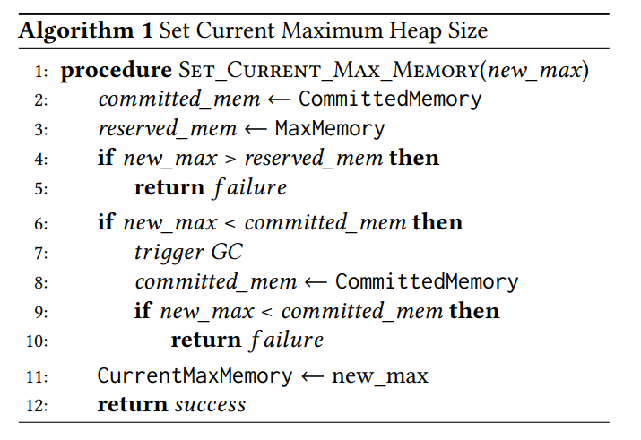
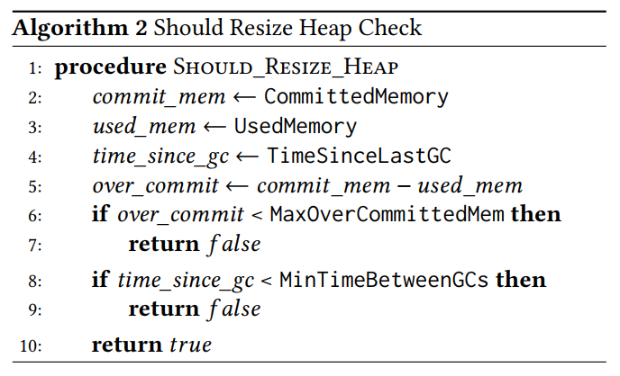

## Dynamic Vertical Memory Scalability for OpenJDK

### 简要介绍

​	随着云平台的兴起，越来越多人将应用部署在云上，而“pay-as-you-use”的收费模式使得用户只需要为它们**实际使用的资源**进行付费，相较于为固定资源的instance付费，“pay-as-you-use”模式能够帮助用户节省经费，同时也能帮助云服务提供商更好地利用硬件资源。考虑到 JVM **固定大小的内存限制**，因此其不能从“pay-as-you-use"模式中收益：如果实际资源需求大于已申请的资源，JVM无法实现动态扩展；而实际资源需求小于已申请的资源总量时，空闲资源完全被浪费。这使得用户在创建JVM时，需要根据JVM上即将运行的应用预估其所需资源。因此，作者提出一项关于JVM堆空间大小可动态扩展的技术，即根据JVM上运行的应用动态地改变JVM的heap size，从而使得以JVM为基础的容器和应用也能享受到“pay-as-you-use”模式的优势。

### 问题背景

​	在云平台上，“pay-as-you-use”模式能够将用户未使用的资源返还给virtualization/container engine(统称为host engine，作用是管理资源)，这些资源能够被其他应用使用。对JVM而言，固定大小的内存限制使得分配给JVM的内存不能发生改变（除非重新创建一个JVM），这使得“pay-as-you-use”模式难以执行，而多余的空闲资源也为用户带来了额外的花费。于是，作者提出要根据用户的需求动态地调整JVM的内存限制，使得JVM能够在内存不足时增大其内存限制，在拥有空闲内存资源时将其返还给host engine。实现JVM的内存限制动态可变不是一件容易的事，主要是因为JVM内部的数据结构是为固定的memory limit而设计，实现memory limit动态可变需要从JVM内部下文章。

### 解题思路

​	既然要实现JVM动态的memory limit，就需要实现以下几点。首先，JVM的memory limit是不可更改的，如何修改这一属性使得memory limit可变而又不对应用程序的执行带来影响。其次，当JVM内存增长时，我们是采取GC操作还是增大memory limit，这其中如何取舍？最后，当JVM所需内存减少时，应该何时以及如何将空闲的内存返还给host engine？我们将对其一一进行阐述：

#### Dynamic Heap Limit

​	提出*CurrentMaxMemory*，表示JVM当前的memory limit。在未提出 *CurrentMaxMemory*前，JVM中有以下metrics（需要注意的是，在未提出dynamic memory limit前，不同GC策略就会执行不同heap grow/shrink操作）：

- UsedMemory: JVM当前已使用的内存，包含live/dead objects
- CommittedMemory: JVM实际申请到的内存，包含UsedMemory和未使用的内存（空闲内存）
- MaxMemory: JVM在启动时设置的memory limit（不可变，$CommittedMemory \sub MaxMemory$）

​	上述表达式（包括作者提到的 *CurrentMaxMemory*）应该满足下式：
$$
CommitedMemory \sub CurrentMaxMemory \sub MaxMemory
$$
*MaxMemory* 在JVM启动时被设置为一个很大的值，*CurrentMaxMemory*在运行时可以动态变化，**作者通过维护 *CurrentMaxMemory*实现动态的memory limit**。

#### Heap Grow and Shrink

**Heap Grow and Shrink** 主要介绍，如何通过修改GC策略控制heap在何时以及怎样grow（memory limit增大）或shrink（memory limit减少）JVM heap，重点在于 heap的grow/shrink需要满足application的需求。

​	grow和shrink放到一起讲，这里需要提一下文章的两个算法。算法1是用来设置 *CurrentMaxMemory*，算法2是决定是否需要更改heap size。

- JVM中存在一个control thread loop，在该循环中会做一些内部检查，如决定是否执行GC等，我们将算法2也放到该control thread loop中定期执行，当JVM中的空闲内存过多或者太久未执行GC时，算法2就会返回true，意味着需要更改heap size（这里通常是减少 heap size），具体操作方式是使用算法1更新 *CurrentMaxMemory*；

- 当used memory接近committed memory时，需要执行的操作可以由JVM原有的相应机制触发并执行适当操作，当committed memory 到达memory limit时，JVM首先会执行GC，而后判断是否含有空闲内存，如果没有则抛出OOM异常。

  本文提到的dynamic方案并未提及具体细节，但根据文章描述和JVM GC本身的性质，在committed memory到达memory limit时应当先执行GC，而后判断是否增加heap size（取决于GC是否能回收足够多的空间）

### 思考与启发

- 本文考虑的是实现 JVM memory limit动态可变，尽管从全文的描述来看其实用性较强，适用的应用也比较广，但本文提到：

  > The solution proposed in this work targets applications that have periodical patterns of memory usage, i.e., applications that can have periods of time with high memory usage and other periods of time with low memory usage    

  即该方案也要求应用在内存使用上具有一定的周期性，其原因在于周期性的应用对dynamic memory limit的需求更加强烈。此外，本文提及的“memory limit随着应用需求而变化“在实现方式上并未收集应用的运行时信息，而是利用GC的执行情况判断当前heap size是否需要减少，从而将多余的内存返还给host engine，这是一种新的实现思路，值得我们学习。但这其中可能存在一些问题，例如反复申请已返还给host engine的内存，前几秒刚通过GC判断需要减少heap size，而后几秒就需要大量内存，进而向host engine申请，这会带来巨大开销。**因此该方案要求应用在内存使用上具有一定的周期性，而具有一定周期性的应用在内存使用上一般不会出现内存需求的猛烈变换**）

- 相较于对 JVM 内部进行大量修改，我们更偏向于本文提及的 portable 的优化方案，其在可维护性和可扩展性上都表现较好。其次，善用JVM自带的工具实现自己的功能，例如本文通过 jstat 实现 *CurrentMaxMemory*的动态变化，该实现方式能够减少性能开销，同时具有较好的兼容性。  