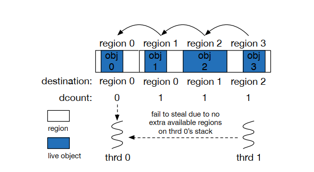
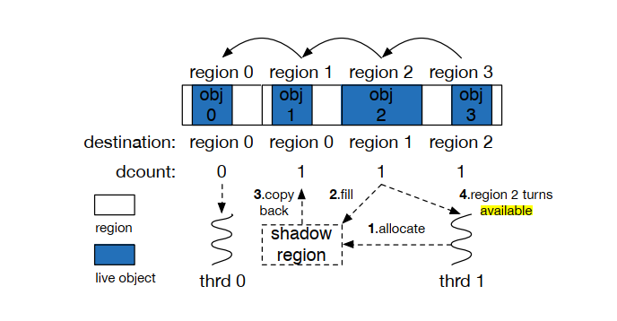

## Analysis and Optimizations of Java Full Garbage Collection

> APSys' 18

### 简要总结

​	Full GC 是 Java GC 中开销较大的一个阶段，由 Full GC 产生的暂停会引发各种各样的问题，而这些问题在类似 Spark 这样的大数据处理系统中更为显著（影响系统的吞吐量和延迟）。因此，作者通过分析 PSGC 中 Full GC 的特点得出其存在如下问题：

- 堆中region之间存在严重的依赖关系，这会影响 GC 线程的利用率
- 堆中许多region包含大量存活对象（这类region被称为dense region），它们无需被GC回收

​	为了解决上述两个问题，作者提出使用dense region以减少region之间的依赖、以及通过skip dense region技术跳过哪些不需要被回收的region。（这里需要注意的是，用户看到的是heap由不同的generation组成，而PSGC实际上将heap分成了许多大小相同的region，例如64KB）

### 问题背景

> 简要阐述背景并且提出问题

​	在 JDK8 以及之前的版本中，GC，例如 Parallel Scavenge，还属于stop-the-world GC。当GC开始回收dead对象时，用户线程会被挂起直到GC结束。尽管JVM将heap分为年轻代和老年代，年轻代较小，GC执行频繁而迅速，这使得每次GC的暂停时间能够被用户所接受。**但内存密集型的大数据处理系统，例如Spark的出现对GC的性能提出了严峻的挑战**。（实际上大数据处理系统会影响young GC和Full GC，如何影响Young GC在Yak那篇文章的背景中已经提及，而本文讨论的是Full GC）。实际上，本文与之前提到的文章，如Yak，在思考问题上也有细微的差别。**Full GC存在的问题（region依赖和dense region问题）在传统应用中也有，只是大数据处理系统将这一问题放大了，例如，region的依赖更加频繁、以及未被处理的dense region较多。于是，在这样的背景下，作者提出需要优化Full GC，使其在大数据处理任务中表现更好**。（Yak那篇文章中大数据应用的特性使得Young GC的某些特性完全不适用，于是作者提出重新设计内存回收模式，这里不再赘述）

### 解题思路

> 阐述解决问题的思路

在阐述解题思路前需要更深入地分析问题的成因，这里先介绍一下一些基础知识。

- 在 PSGC 中，Full GC 在整个堆空间的内存资源被消耗完毕时触发，负责回收young generation和old generation
- PSGC 将堆空间分为许多大小相同的region，在回收内存时，将每个region以任务的形式分配给GC线程回收
- Full GC 分为三个阶段：mark、summary以及compaction。mark阶段通过root标记那些live objects并记录它们的位置，summary阶段分析每个region的dest region，即该region中的所有对象应该被复制到dest region中。而compaction阶段则是执行复制操作，这也是最耗时的阶段，值得我们优化。需要注意的是，某个dest region可能也是source region，即该region中的对象也需要被复制到其他某个dest region。因此，GC在某个region中的所有对象被复制到其dest region前不会处理该region（这里的处理该region是指将该region相关的所有source region中的对象复制过来）

​	了解上面这些基础知识后，我们就可以了解前文提及的问题的具体成因。

**Dependency Optimization**

​	在上图中，region1、3、4被分配给线程1，而region5被分配给线程2处理（此时region0和region2都是dest region）。两者被分配到的任务不均衡，这种现象被称为“load imbalance”。对于这种现象，Full GC支持`work stealing`，即某个线程处理完手头的任务之后可以去其他线程手里“偷”region过来处理，前提是这个region是可用的，不能是别的线程正在处理的region。

​	上图展示了`steal faile`现象，即线程0正在处理region0，线程1空闲，尝试从线程0中“偷”region过来处理，但region0、1、2、3均为`unavailable`，因此出现`steal fail`，使得GC 线程利用率大大降低。实验表明，`steal fail`现象十分普遍，因此作者认为这是影响GC线程利用率的主要原因。

​	作者提出使用shadow region的技术优化这一现象。

​	首先，如果某个region是`unavailable`的，那么别的线程仍然可以来“偷”它。例如上图中，线程1可以steal region1。具体操作是创建一个shadow region，将让egion1的source region中的对象全部拷贝到shadow region中，并在region1 `availabe` 时将shadow region中的对象拷贝到region1中。

**Region Skip**

​	而在Spark中，应用通常会产生大量数组，这些对象很容易填满整个region，使其成为`dense region`。考虑到大数据处理系统的特性，`dense region`会“充斥”在这个堆空间中，而这些region在Full GC执行时则可以跳过（PSGC中存在一种`dense prefix optimization`的技术跳过dense region，但实验结果表明在大数据任务中，有超过1/3的region无法被这项技术处理，因此，设计如何跳过dense region的研究是有必要的）。实现 `region skip`的基本思路是跳过那些所有对象对存活的region，在compaction阶段对其不作处理。

### 总结与启发

>总结全文并简要阐述阅读文章时受到的启发

​	本文提出优化Full GC，首先作者结合实验和理论分析了Full GC的一些特性，而后发现了导致GC效率低下的原因，最后提出shadow region和region skip的方法优化GC。本文的启发如下：

- 本文为优化大数据处理系统的内存使用提供了一个新的角度，例如，`move unneccessary compaction in Spark's Full GC`，如果某些不必要的GC可以不做，以此带来的性能优化必将是巨大的，我们可以借鉴这项思路，但是从另一个角度去解决问题；
- 在已有`dense prefix optimization `处理dense region的情况下，作者实现的region skip是有必要的吗？**作者通过实验，并结合理论**说明了`dense prefix optimization `存在缺陷，因此有必要实现新的region skip机制；这不仅回答了我们的疑问，也为我们的工作规划了方向。已有的工作是哪些，它的缺陷在哪？我们是否有必要做类似的功能等；
- 需要多读源码，并且结合实际的实验，作者的解决方案不是凭空想象的，而是通过已有现象和本质分析出的解题思路；
- 思路和实现中间可能差的很多，idea到具体实现存在大量优化，例如本文提到的多线程问题以及shadow region带了的额外开销。当然，优化这项工作本来就是可以一直继续，如何取舍值得我们去考虑，作者将开销优化到一定程度后选择停止，因为进一步优化必然会导致更加复杂的机制，从而引入新的问题。在不带来较多开销能较好地达到目的即可。

### 参考文献

> 介绍一些与本文研究工作相关的参考文献

- Google. 2018. Chrome V8. https://developers.google.com/v8/    
- Erik Österlund and Welf Löwe. 2016. Block-free concurrent GC: stack scanning and copying. In Proceedings of the 2016 ACM SIGPLAN International Symposium on Memory Management. ACM, 1–12    
- Kun Suo, Jia Rao, Hong Jiang, and Witawas Srisa-an. 2018. Characterizing and optimizing hotspot parallel garbage collection on multicore systems. In Proceedings of the Thirteenth EuroSys Conference. ACM, 35:1–35:15    

