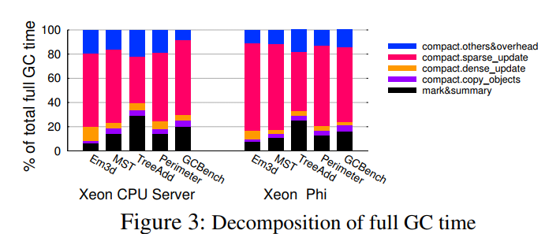

## Performance Analysis and Optimization of Full Garbage Collection in Memory-hungry Environments     

### 1. 简要介绍

​	full GC会对那些需要大量内存的大数据处理应用产生巨大影响，本文主要阐述了PS（Parallel Scavenge，GC的一种）中full GC的性能分析，提出在full GC的压缩阶段（compaction phase）更新引用时，**不必要的内存访问和计算**是导致full GC执行时间较长的主要原因。为此，本文提出了一种**增量式查询模型**用于优化full GC的引用更新。

### 2. 背景

​	大数据处理系统、高性能计算等领域通常使用托管型语言进行开发，尤其是Java。（这点在之前的文章中有所介绍），而大数据系统中会出现memory bloat和由多核处理器架构引起的内存不足问题（memory bloat指应用产生大量对象，而多核处理器的出现使得单个机器上存在许多共享该机器内存资源的任务，这使得每个任务分配到的内存进一步减少，进而加重大数据处理系统面临的内存问题）。GC会占据应用执行时间的一大部分，并且在涉及到多个节点时落后者现象会拖慢应用的整体执行。因此，本文想根据GC的性能表现深入了解GC并提出一些优化方案，而full GC比minor GC的暂停时间更长，对应用产生的影响更大。于是，本文选取PS的full GC进行性能分析和研究。研究显示，性能瓶颈位于compact phase的引用更新处，**该过程存在大量冗余的计算和内存访问**。针对这一现象，作者提出“**增量式**查询”，即充分利用前一次查询提供的信息。而不同的对象引用具有不同特征，因此“增量式查询”又可按照不同的方式实现（optimistic、sort-based、region-based，后文会详细提及）。

### 3. 解题思路

​	这部分主要介绍如何对full GC进行性能分析，并且介绍如何根据分析结果得到“增量式查询”的解决方案以及阐述“增量式查询”的细节。

#### 3.1 性能分析

​	在介绍性能分析前需要了解PS的full GC过程。PS的full GC采用mark-compact算法回收堆空间，主要包含三个阶段：

- marking：利用2个bitmap将对象映射到整个堆空间（一个bitmap用于记录对象的begin address，另一个用于记录end address），bitmap中的两个address用于判断对象是否存活，存活的对象会位于堆中的某个region中，对象是否存活的信息会被记录到region的元数据中（用于回收内存空间）

- summary：计算每个对象的新地址（new location），**这部分工作开销较小**

- compacting：将对象**复制到其对应的新地址**并且**更新对象包含的引用**，下图显示了对象的复制方法（region会记录第一个存活对象的目标地址，通过bitmap可以找到后续存活对象的地址和**大小**，然后将其移动到第一个存活对象的后续内存空间中）：

  

​	下面介绍性能分析的详细过程，这部分是为了找出full GC中真正耗时的操作。

​	作者得出，full GC中compact阶段是最耗时的。并且，从上图中可以看出，引用更新的时间占据了compact阶段的大部分时间（包括sparse_update和dense_update）。在进一步观察，sparse_update最耗时。至于sparse_update和dense_update的区别可以参看下面这个算法：

​	当对象未被移动前所在的region中所有对象都存活时，我们可以直接把之前的offset当做新region中的offset（**这种现象比较少见**）。若不是都存活，offset则是第一个对象的大小再加上第一个对象结尾到给定的offset之间所有对象的总大小。实验结果表明，图中的`sparse path`最耗时，应当进行优化。

#### 3.2 增量式查询（Incremental  Query，IQ）

​	很容易观察到，3.1中的sparse_update存在冗余操作。例如更新图1中的对象A和B时就存在多余的object size计算。为了消除多余的计算和内存访问，作者提出了增量式查询，在后一次查询中可利用前次查询已经计算好的live objects大小。

​	上述算法简要阐述了IQ（增量式查询）的思想，其中`beg_addr`和`end_addr`是搜索区间（搜索这个区间的live object大小用于更新某些对象的引用），而`last_beg_addr`和`last_end_addr`则是上次query的搜索区间。代码比较好懂，这里就不详细展开了。考虑到很多应用的query不是发生在同一个region中，因此作者提出了三种“增量式查询”的实现手段（scheme）。

##### 3.2.1 Optimistic IQ

​	乐观地认为大部分的query都是local的（即作用于同一个region中），直接使用上文提到的算法2。

##### 3.2.2 Sort-based IQ

​	关键在于`sort`，字面意思，用一个缓冲区缓存所有的query，当query满时按照其region进行排序，这样一来就可以充分利用算法2实现增量式查询。但是，该方法可能会带来额外的排序开销。

##### 3.2.3 Region-based IQ

​	为每个region维护一个`last_beg_addr`和`last_end_addr`变量。为了避免query的搜索范围过大，作者还提出了分片查询的概念，即将每个region进行分片，并维护每个分片的`last_beg_addr`和`last_end_addr`等变量。同时，为了减少内存开销，Region-based IQ还做了一些优化，例如，考虑到维护的变量涉及的对象所处的region永远都不会改变，因此变量的开销还可以进一步缩小。

上述三种实现方案与bit map相比contention得以大大减少（因为不同线程或region的`last_beg_addr`和`last_end_addr`等变量互相独立）

### 4. 总结与启发

​	这是一篇比较短小的文章，但其研究问题的思路和提出的方法都比较优秀，文章主要思想是找准PS的full GC中较为耗时的部分，并对其进行专门优化。由于自己对full GC的细节不是很了解，因此只做出了简要总结，启发如下（比较浅显）：

- 本文提到，GC使用bitmap进行对象的标注和移动，其中蕴含了许多巧妙的“节省空间和时间“的方法，这部分有空可以深入了解一下；

  >  In the marking phase, the collector utilizes an important data structure called mark bitmap to map the whole heap space    

- 这篇文章虽然很短，但作者研究问题的思路和方式很值得我们学习，包括一开始的背景阐述和问题提出、结合实验得出性能瓶颈、层层剖析找到适合优化的部分以及系统地提出三种实现方案等，这些步骤层层相扣，使得读者能够轻松阅读。

- 值得注意的是，虽然文章开头介绍了大数据应用场景，但在后续优化过程中弱化了这一背景（看起来好像传统应用也可以用这种优化手段）。这是因为在传统应用场景下，这些优化带来的性能提升可能比较小。而大规模数据集在放大GC缺点的同时也放大了本文提及的full GC优化手段的优点。因此，从这一点看，介绍大数据应用场景以及在大数据应用场景下的各种实验都是有必要的。

