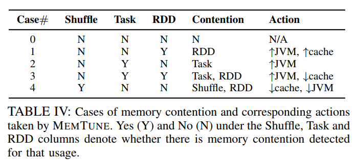

# MEMTUNE

## 简要阐述干了什么

​	在类似于Spark，M3R这样的大数据处理框架中，内存主要用来计算（computation）和缓存中间数据（cache intermediate data）。为了更好地优化大数据处理系统的内存使用，现有的技术一般根据作业的profile**静态地**将内存分为两部分，其中一部分用于计算，另一部分用于缓存（实验表明缓存带来的性能提升十分显著）。但是，这样的静态分割方法无法捕捉到作业的动态需求，例如，作业在执行的过程中有时需要更多内存用于计算，有时需要更多内存用于缓存。静态的内存划分无法捕捉到这种变化，因此会导致内存使用效率低下。故本文提出应当在应用**运行时**（runtime），根据作业执行情况**动态地**调整用于计算/缓存的内存大小。除此之外，考虑到现有的数据放置和回收策略（如，Spark在内存中使用LRU策略放置和清除RDD）会对缓存的命中造成影响，本文还对数据放置和回收策略进行了优化。具体表现为：1.根据**数据处理框架层的调度信息**清除内存中在未来不会使用到的数据；2. 实现task-level的数据预加载机制，即提前将需要用到的数据缓存在内存中。

## 背景

​	在Spark中，缓存（cache）的重要性不言而喻，但内存不仅仅用作缓存，也可用于计算（computation）和 data shuffle；通常情况下，Spark框架通过用户指定的方式设置缓存空间的占比，这种方式是静态的，无法随着应用的执行而变化，因此无法捕捉应用在执行时所表现的不同内存需求。此外，该方式还要求使用者对输入数据的大小以及数据之间的依赖等信息十分了解，即需要经验丰富的程序员才能做出**较为**正确的选择。因此，作者提出，在运行时动态地调整缓存空间（memory for data cache）、计算空间（memory for computation/process）和shuffle空间（memory for shuffle）的占比有利于提高内存的利用率。但是，该方案也存在一定的挑战：

- 需要数据处理框架层提供精确的统计信息，例如shuffle阶段和每个task的内存消耗，这些信息很难获得；
- 既然涉及到缓存空间占比的动态变化（在应用执行过程中动态地调整由于cache的内存大小），某些数据在缓存空间减少时应当被清除，在其增加时可以被提前缓存到内存中。如何确定这些需要清除和缓存的数据，这是一个具有挑战性的问题。

## 解决思路

​	为了解决上述问题，作者提出的解决方案——MEMTUNE主要包含dynamic memory tuning和data eviction/prefetch两大要点。在介绍它们之前，我们首先介绍相关实验（Section 2）揭示的Spark内存使用特性：

- Spark中每个executor上运行着多个任务，它们共享该executor的JVM heap。因此，缓存空间大小（cache size)的变化会影响该executor上的task执行。当cache size增加时，task computation的内存减少，会导致竞争加剧；
- 理想的动态调整策略应在task执行computation需要消耗大量内存时减少cache size，而在内存较为空闲时增加cache size以增加缓存命中率；
- Spark使用LRU策略清除缓存的RDD，实验结果显示该策略并未考虑RDD间的依赖关系。如果能利用DAG代表的工作流提供的指导信息（xxx stage依赖xxx RDD），缓存的命中率得以进一步提升，可减少RDD重新计算和I/O带来的额外开销。

​	下文是MEMTUNE的两大要点：

### Dynamic Memory Tuning

> 调整用于cache、computation和shuffle的内存占比，以提高内存资源利用率并减少内存竞争（monitor the task memory consumption using statistics such as gc duration and memory paging frequency）

​	作者在每个executor上实现了monitor组件用于收集运行时信息，例如，垃圾回收时间，内存交换，任务执行时间和输入输出数据集的大小等。master节点拿到这些信息后做出决策，例如，设置某个JVM的RDD cache size。因此，关键在于如何根据收集到的统计信息做出适合的决策，即统计信息揭示的内在规律是什么。

​	由于前文提到，task computation、shuffle sort和RDD cache会占用JVM heap，shuffle buffer会占用JVM heap之外的内存。在使用内存这件事上，他们会产生竞争。因此，作者**通过统计信息提供的参数：*Th_GCup*、*Th_GCdown*和*Th_sh*等决定在不同场景下应当执行何种操作**，详细操作可以参看文章提出的算法，这里的表格展示了5种情况和其对应的竞争情况以及适合的操作：

### Data eviction/prefetch

​	这部分主要是RDD的清除与预加载。其中，RDD清除是在cache size减少时找到那些暂时不用的RDD将其清除，而预加载则是根据Stage对RDD的依赖关系在Stage开始前将RDD预加载到内存中，两者均利用了DAG中Stage间的依赖关系。

#### RDD eviction policy

​	考虑某个task对RDD block的依赖，RDD block被分为不同类型。当清除操作触发时，类型为 *finished_list* 的RDD block最先被清除，具体细节可查看文章的Section 3C.

#### Prefetch and Prefetch Window

​	RDD的prefetch则是根据DAG提供的工作流信息，在task执行前将其依赖的RDD缓存到内存中。而Prefetch Windows类似于缓冲区的大小。当task computation需要占据更多内存时，cache size应当减少。因此，prefetch window会减少以降低数据的预加载，为task computation腾出内存空间。

## 思考与启发

​	上述内容大致阐述了MEMTUNE的研究背景以及实现思路，具体实现在文章和代码中都有详细介绍，此处不再赘述。本文主要致力于更好地利用内存资源，具体实现方法是动态地调整缓存空间占比，使其更加符合应用本身的内存需求，并在此基础上优化缓存的命中率以进一步提高内存利用率。在阅读文章后，我想总结几点收获：

- 本文通过位于各个executor上的monitor获得统计信息，并结合该信息调整cache size的大小，以实现动态的内存调整。（堆空间大小并未发生变化，改变的是cache size的占比）该技术的关键在于需要获取哪些统计信息，以及拿到统计信息后如何得到策略。作者只是简单收集了GC和memory swap的信息并通过该信息判断出当前是否存在task computation或shuffle read/write，而后根据判断结果适当减少或增加cache size的大小。需要注意的是，整个过程都是在线的。

  这对弹性内存管理方案的实现有一定指导作用，而重点也在于根据统计信息分析出当前处于何种情况，而根据该情况制定何种策略有很多种实现方式。从GC和数据处理框架层拿到的信息正是优化大数据处理系统的内存使用需要的指导信息。**什么样的信息**能够说明某些对象**处于何种状态**，这正是我们的研究工作需要寻找的；

- Data prefetch/eviction这块内容用到了DAG，也就是task的调度信息；同样，这部分信息也能为我们所用，它能告诉我们当前应用已经执行到何种程度，而要实现**在线**的内存优化工作必然需要结合task的调度信息一起考虑；

- **其他：**实验的指导、迭代式应用的选取（logistic regression、linear regression和pagerank等）、作者提出后续工作应在统计信息中包含**内存使用的估计**（memory usage estimation），可以follow一下。